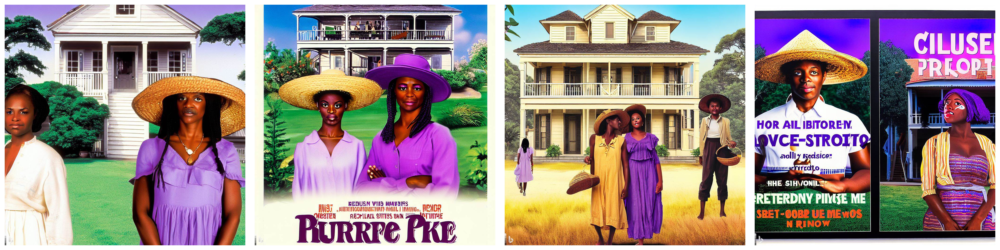
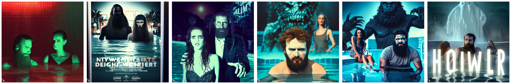
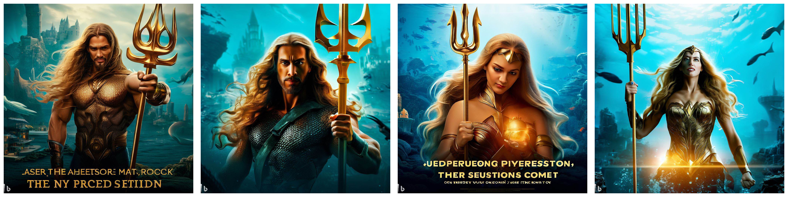
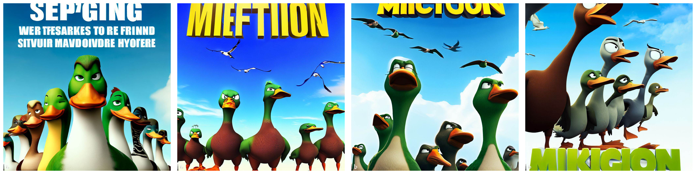
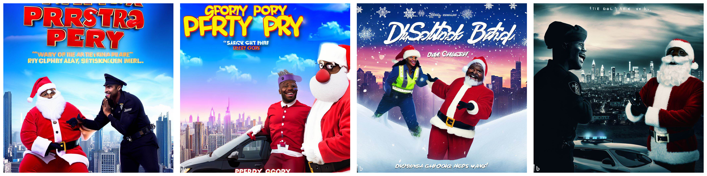

# Computer Graphics – Text-to-Image

> **To get started:** Clone this repository using
> 
>     git clone http://github.com/alecjacobson/computer-graphics-text-to-image.git
>

## Background

## Tasks

### `movie-poster.zip`


Generate a movie poster for a real upcoming film. Your poster must:

 - be visually attractive,
 - reflect the [genre](https://en.wikipedia.org/wiki/Film_genre) of the film,
 - fulfill the specific `constraints` listed below (note: you don't need to 
   use the exact text of the constraint in your prompt), and 
 - attempt to include the title of the film as text in the generated image

Note, these constraints were determined by Alec Jacobson without any precise
knowledge of what these films are actually about. Any spoilers are purely
coincidental.

Include at least 10 drafts (including final image).



> B- Work.


```
"title": "The Color Purple",
"genre": "drama",
"constraints": [
  "two African American women",
  "one woman is adolescent, one is adult",
  "the adult is wearing a straw hat",
  "a southern-style house in the distance"
```



> B- Work. 

```
"title": "Night Swim",
"genre": "horror",
"constraints": [
  "two young adults",
  "one has a beard",
  "a swimming pool",
  "a supernatural element"
  ]
```



> B- Work. 

```
"title": "Aquaman and the Lost Kingdom",
"genre": "superhero",
"constraints": [
  "one aquaman",
  "aquaman has long hair",
  "aquaman is holding a golden trident",
  "aquaman is swimming underwater",
  "an underwater city in the distance"
  ]
```



> C+ Work. Can you even count?

```
"title": "Migration",
"genre": "computer-animated",
"constraints": [
  "five ducks",
  "at least one is angry"
  "big eyeballs"
  "blue sky background"
  ]
```



> B- Work.

```
"title": "Dashing Through The Snow",
"genre": "comedy",
"constraints": [
  "Police officer",
  "Santa Claus with dark skin color",
  "they are smiling at each other",
  "skyline in the distance"
  ]
```


