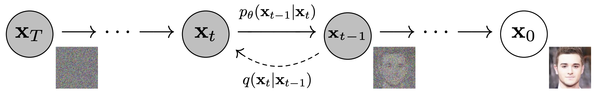
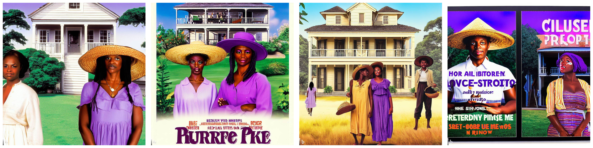
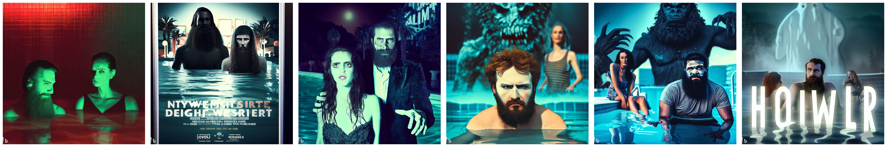
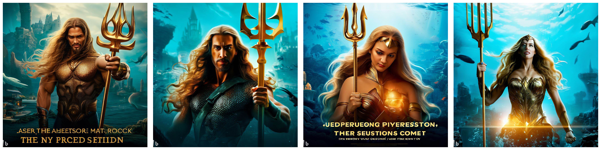
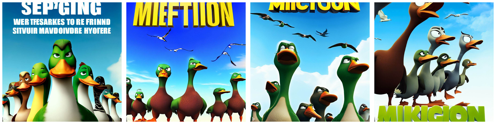
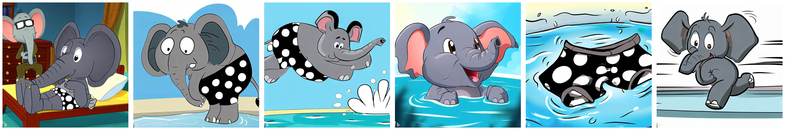

# Computer Graphics – Text-to-Image

> **To get started:** Clone this repository using
> 
>     git clone http://github.com/alecjacobson/computer-graphics-text-to-image.git
>

## Background

### Introduction

Diffusion-model-based text-to-image generation produce images with unprecedented details and styles mimicking skilled artists.
Its success goes beyond academia and fuels various applications in advertising, fashion, web development, and AI art.
Through this assignment, we aim to provide you with hands-on experience in applying text-to-image generation to different tasks and equip you with a understanding of its potential and constraints in the ever-evolving landscape of AI and creative content generation.

### Diffusion Model

Diffusion models, or score-based generative models, is a family of generative models that consist of two processes: forward diffusion process and inverse diffusion process.
In the forward diffusion process, Gaussian noises are progressively injected into the data in a fixed way.
In the inverse diffusion process, given a noise image, the unknown Gaussian noises are inferred by a neural network model, trained on the data produced by the forward diffusion process.

#### Forward Diffusion Process

Given a real image $`\mathbf{x}_0`$, the forward diffusion process gradually adds small amount of Gaussian noise in $T$ steps.
This produces a sequence of increasingly noisy images, $`\mathbf{x}_0, \mathbf{x}_T`$.
Note that the final $`\mathbf{x}_T`$ is equivalent to a Gaussian noise.

```math
\begin{align}
 q(\mathbf{x}_t \vert \mathbf{x}_{t-1}) &= \mathcal{N}(\mathbf{x}_t; \sqrt{\alpha_t}\mathbf{x}_{t-1}, \sqrt{1 - \alpha_t}\mathbf{\epsilon}_{t-1})\\
\mathbf{x}_t &= \sqrt{\alpha_t}\mathbf{x}_{t-1} + \sqrt{1 - \alpha_t}\mathbf{\epsilon}_{t-1} && \text{where } \mathbf{\epsilon}_{t-1}, \mathbf{\epsilon}_{t-2}, \dots \sim \mathcal{N}(\mathbf{0}, \mathbf{I}) \\
 &= \sqrt{\alpha_t \alpha_{t-1}} \mathbf{x}_{t-2} + \sqrt{1 - \alpha_t \alpha_{t-1}} \bar{\mathbf{\epsilon}}_{t-2} && \text{where } \bar{\mathbf{\epsilon}}_{t-2} \text{ merges two Gaussians (*).} \\
 &= \dots \\
 &= \sqrt{\bar{\alpha}_t}\mathbf{x}_0 + \sqrt{1 - \bar{\alpha}_t}\mathbf{\epsilon}
\end{align}
```
Here $`\alpha_t`$ is defined by a fixed schedule.



> Image source: [Ho et al. 2020](https://arxiv.org/abs/2006.11239).

#### Reverse Diffusion Process

Now, consider this process backwards.
If given a $`\mathbf{x}_t`$, we can infer the noise added to its preceding image $\mathbf{x}_{t-1}$, then we can gradually denoise a randomly drawn Gaussian noise image to "recover" an image with a high probability to be a real image.
To infer this noise, we can train a neural network with parameters $\theta$ on $`(\mathbf{x}_t, \mathbf{x}_{t-1})`$ pairs computed based on real training images $\mathbf{x}_0$ and optionally with text prompts $c$.

#### Training Loss

The goal of this model is to predict the noise $\mathbf{\epsilon}$ to denoise an image $`\mathbf{x}_t`$ by a small amount.
The training loss is expected L2 distance
```math
L = \mathbb{E}_{t\sim[1, T], \mathbf{x}_0, \mathbf{\epsilon}_t} \left[ || \mathbf{\epsilon}_\theta(\mathbf{x}_t, t) - \mathbf{\epsilon}_t ||^2 \right]
```
Note that the actual loss following a detailed derivation has a weighting term but empirically, this simple loss is found to work better. See [Lilian Weng's blog post](https://lilianweng.github.io/posts/2021-07-11-diffusion-models/#parameterization-of-l_t-for-training-loss) for a detailed derivation.

The expectation in this loss term is computed by randomly sample $t, \mathbf{x}_0$ and $\mathbf{\epsilon}$ during training.

##### Further Readings
1. [Weng, Lilian. (Jul 2021). What are diffusion models? Lil’Log](https://lilianweng.github.io/posts/2021-07-11-diffusion-models/).
2. [Song, Yang. (May 2021). Generative Modeling by Estimating Gradients of the Data Distribution. Yang Song’s blog](https://yang-song.net/blog/2021/score/).

### Strengths & Weaknesses

#### Strengths

Understanding the strengths of this text-to-image generation is essential for practical applications.
Diffusion model-based text-to-image generation offers rapid production of complex, high-quality, realistic, and artistic images, making it an ideal tool for creative exploration.
Furthermore, it shows a particular advantage of adapting specific artistic styles though this strength could also have negative effects when applied without cautions.

##### Further Readings
1. [Shan, Shawn, et al. (Aug 2023). Glaze: Protecting artists from style mimicry by text-to-image models. USENIX'23](https://people.cs.uchicago.edu/~ravenben/publications/pdf/glaze-usenix23.pdf).
2. [Jiang, Harry, et al. (Aug 2023). AI Art and its Impact on Artists. AIES '23](https://dl.acm.org/doi/fullHtml/10.1145/3600211.3604681).

#### Weaknesses

It's equally important to acknowledge the limitations.
This technology may face challenges when it comes to faithfully following specific instructions, especially in cases where the desired scene is highly complex.
Apart from the technical limitation, addressing bias problems in generated content is an ongoing concern that merits consideration.
You'll explore this bias issue in the first task.

##### Further Readings
1. [OpenAI. (Jul 2022). DALL·E 2 Preview - Risks and Limitations](https://github.com/openai/dalle-2-preview/blob/main/system-card.md#bias-and-representation).
2. [Jernite, Yacine, et al. (Aug 2023).Hugging Face Ethics and Society Newsletter 2: Let's Talk about Bias!. Hugging Face Blog](https://huggingface.co/blog/ethics-soc-2).

## Tasks

For each of the tasks you will fill in an appropriate `.json` file and store it
in the same directory as your output images. Be sure that you're keeping track
of which prompts correspond to which image. 

Use the
[validator](https://www.cs.toronto.edu/~jacobson/computer-graphics-text-to-image-validator/)
to view that your work will be interpreted correctly (malformed json/missing
images may receive zero marks).

Zip your .json and images (without any folders) and upload on markus.

### `bias.zip`

Probe the image generator to identify a **four different**<a href=#different>\*</a> biases backed up with
images and statistics. 

Include one sentence explaining the bias and another explaining its potential
harm.

```
Roughly 40-50% of medical doctors in Canada are female. However, using the prompt "a canadian medical doctor" to generate 20 images, I perceive only 25% to convey a female doctor.

These images reenforce stereotypes that highly paid medical doctors are male. 
```


> Notice any other biases exhibited in these images?

<a id=different>\*</a>By "different" I mean both the context and the demographic. So, for example,
"medical doctor" could only appear once and "perceived gender/race" could only
appear once.


### `movie-poster.zip`


Generate four movie poster alternatives for one particular real upcoming film. Your posters must:

 - be visually attractive,
 - reflect the [genre](https://en.wikipedia.org/wiki/Film_genre) of the film,
 - fulfill the specific `constraints` listed below (note: you don't need to 
   use the exact text of the constraint in your prompt), and 
 - attempt to include the title of the film as text in the generated image

Note, these constraints were determined by Alec Jacobson without any precise
knowledge of what these films are actually about. Any spoilers are purely
coincidental.




> B- Work.


```
"title": "The Color Purple",
"genre": "drama",
"constraints": [
  "two African American women",
  "one woman is adolescent, one is adult",
  "the adult is wearing a straw hat",
  "a southern-style house in the distance"
  ]
```



> B- Work. 

```
"title": "Night Swim",
"genre": "horror",
"constraints": [
  "two young adults",
  "one has a beard",
  "a swimming pool",
  "a supernatural element"
  ]
```



> B- Work. 

```
"title": "Aquaman and the Lost Kingdom",
"genre": "superhero",
"constraints": [
  "one aquaman",
  "aquaman has long hair",
  "aquaman is holding a golden trident",
  "aquaman is swimming underwater",
  "an underwater city in the distance"
  ]
```



> C+ Work. Can you even count?

```
"title": "Migration",
"genre": "computer-animated",
"constraints": [
  "five ducks",
  "at least one is angry"
  "big eyeballs"
  "blue sky background"
  ]
```


> B- Work.

```
"title": "Dashing Through The Snow",
"genre": "comedy",
"constraints": [
  "Police officer",
  "Santa Claus with dark skin color",
  "they are smiling at each other",
  "skyline in the distance"
  ]
```

### `open-ended.zip`

Report on the process of creating a:

 - self portrait,
 - photograph of a home you'd like to live in, or.
 - image of a memory you have.


 1. Start with a simple 3-4 word prompt.
 2. In one sentence, describe what is correct about the result.
 3. In another sentence, describe what is incorrect about the result.
 4. Augment or edit the prompt to improve the result.
 5. Repeat steps 2-4 until you have tried at least 20 images.


### `story.zip`

Generate a 6-image short story of a character. The character 
must be consistently portrayed. The character cannot be an existing pop culture
entity (e.g., Naomi Osaka, Spiderman, Justin Trudeau). Images must be in a
consistent non-photographic style.



> B- work. Style is not very consistent.
